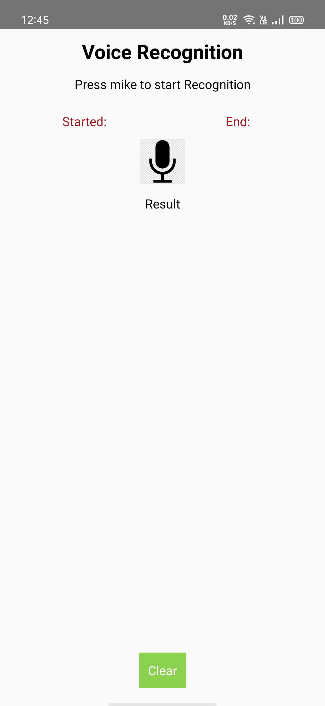
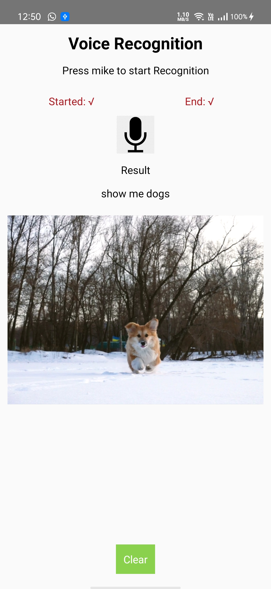
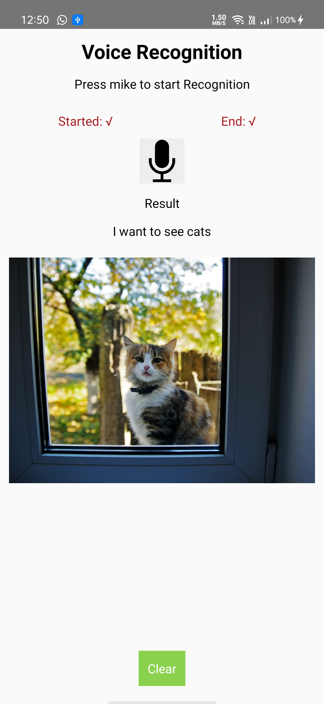

#  Voice-Recognition-and-video

## How to run the project:
Type ***npm install*** before running project

## Screenshots:

Landing Screen

Click on microphone and say "Show me dogs" and it will show the video of dog.

Click on microphone and say "I want to see cats" and it will show the video of cat.

